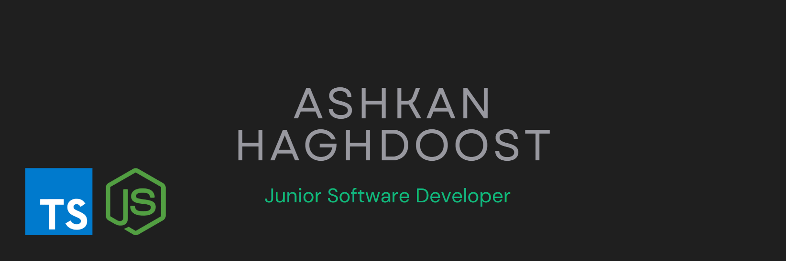

# Hi 👋

I'm a **Web Backend Developer** with eight months of experience in developing and implementing backend systems for the web. My expertise lies in **JavaScript** and **TypeScript**, and I have a strong understanding of RESTful API architecture and technologies like **Redis** and **Drizzle ORM**. I am adept at solving complex problems and optimizing the performance of existing systems. Additionally, I possess excellent teamwork and communication skills, which enable me to collaborate effectively with other team members.

## 🌱 Currently Learning

- **TypeScript**
- **Redis**
- **Drizzle ORM**
- **PostgreSQL**

## 🛠️ Technologies I Use Most

  
  
  
  
  
  
    
  

## 📫 How to Reach Me

- **Email**: [ashkanhagh01@gmail.com](mailto:ashkanhagh01@gmail.com)
- **Telegram**: [AshkanHaghdoost](https://t.me/AshkanHaghdoost01)

